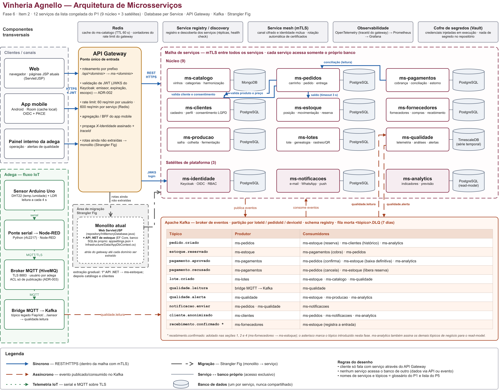

# Fase 6 — Arquitetura de APIs e Microsserviços
## Item 2 — Diagrama de Arquitetura

| Campo | Valor |
|---|---|
| Arquivos | `P2_arquitetura.drawio` (editável, 4 páginas) · `P2_arquitetura.png` · `P2_arquitetura.svg` · `P2_arquitetura_d1_servicos.*` · `P2_arquitetura_d2_eventos.*` · `P2_arquitetura_d3_iot_migracao.*` |
| Responsável | Kevin Benevides da Silva Romariz — RM 557898 |
| Período | 22/09/2026 → 28/09/2026 |
| Fonte dos nomes | Glossário do P1 (item 6) e lista de tópicos do P5 |
| Revisão de consolidação | 29/09/2026 (Yasmin Kimura, P5): figuras de detalhe para o critério de legibilidade, citações de caminho do repositório e correção do rótulo do monolito; conferência cruzada com o P4 em 01/10/2026 (tópicos, produtores e consumidores) |



> No `.docx`, inserir o `P2_arquitetura.svg`: é vetorial (permite zoom sem perder nitidez) e tem o texto convertido em curvas, então o Word não depende de fonte instalada. O `.png` (3992 × 3126) serve para chat e slides.

## 2.1 Como ler o diagrama

O desenho é lido da esquerda para a direita. Os **clientes** — web (páginas JSP atuais, em `Web/src/main/java/br/com/fiap/vinheriaagnello/`), app mobile (Android/Room, em `Mobile/app/src/main/java/com/example/myapplication/data/local/`) e painel interno da adega — só entram no sistema pelo **API Gateway**. Ele roteia por prefixo (`/api/<dominio>` → `ms-<dominio>`), valida o JWT emitido pelo `ms-identidade` (Keycloak, ADR-002 — `Documentacao/Fase6/adr/ADR-002-validacao-token-gateway.md`), aplica o *rate limit* com contadores no Redis e faz a agregação (BFF) do app mobile. Dentro da **malha de serviços**, toda chamada trafega com mTLS.

Os **12 serviços** da lista congelada do P1 aparecem com os mesmos nomes: 9 de núcleo e 3 satélites de plataforma. Cada um tem **seu próprio banco** (Database per Service): PostgreSQL na maioria, MongoDB no `ms-catalogo`, TimescaleDB (série temporal) no `ms-qualidade` e um read-model PostgreSQL no `ms-analytics`. Nenhuma linha liga um serviço ao banco de outro.

A camada assíncrona é o **Apache Kafka**. A tabela dentro do bloco lista cada tópico com seu produtor e seus consumidores. O fluxo de compra segue a saga do P5: `pedido.criado` → `estoque.reservado` → `pagamento.aprovado` ou `pagamento.recusado` → confirmação ou cancelamento → `notificacao.enviar`.

O **fluxo IoT** aparece à esquerda, embaixo: sensor Arduino (`Arduino/VinheriaSensores/VinheriaSensores.ino`) → ponte serial (`MQTT/bridge_wokwi_nodered.py`) → Node-RED (`MQTT/node_red_vinheria_flow.json`) → broker MQTT (TLS, usuário por adega, ADR-003 — `Documentacao/Fase6/adr/ADR-003-mqtt-identidade-por-dispositivo.md`) → *bridge* MQTT → Kafka, que publica `qualidade.leitura`. O `ms-qualidade` consome a leitura e publica `qualidade.alerta` e `notificacao.enviar`.

A **área de migração** mostra o *Strangler Fig*: o monolito atual — o web Servlet/JSP (`Web/src/main/java/br/com/fiap/vinheriaagnello/`, com `repository/InMemoryDatabase.java`) e a API .NET de estoque (`Web/src/VinheriaAgnello.Server/`, EF Core com um único banco SQLite configurado em `src/VinheriaAgnello.API/appsettings.json` e mapeado em `src/VinheriaAgnello.Infrastructure/Data/AppDbContext.cs`) — fica atrás do gateway, que continua mandando para ele as rotas ainda não extraídas. O primeiro domínio extraído é o estoque, porque a API .NET já é o embrião do `ms-estoque` (P1, item 4). Catálogo e clientes vêm em seguida.

## 2.2 Legenda

| Traço | Significado |
|---|---|
| Linha contínua grossa, azul | Síncrono — REST/HTTPS (dentro da malha com mTLS) |
| Linha tracejada longa, vermelho-tijolo | Assíncrono — evento publicado/consumido no Kafka |
| Linha pontilhada, verde | Telemetria IoT — serial e MQTT sobre TLS |
| Traço-ponto, cinza, seta aberta | Migração Strangler Fig (monolito → serviço) |
| Linha fina sem seta | Serviço ↔ banco próprio (acesso exclusivo) |

Os tipos de comunicação se distinguem pelo **padrão do traço**, não só pela cor, então a figura continua legível em impressão preto e branco.

## 2.3 Conferência dos critérios de aceite

| Critério | Situação |
|---|---|
| Todo microsserviço do P1 aparece; nenhum serviço inventado | 12 de 12, com os nomes do glossário. Redis, registry, mesh, observabilidade, Vault e a *bridge* MQTT → Kafka são infraestrutura, não serviços de domínio (mesmo critério do P1, item 3, para o Node-RED) |
| Síncrono × assíncrono distinguíveis pela legenda | Sim: traço contínuo × tracejado, além da cor — legenda repetida em cada uma das 4 páginas |
| Nenhum acesso direto ao banco de outro serviço; cliente só via gateway | Sim: cada banco liga a um único serviço; os três clientes apontam apenas para o gateway |
| Nomes dos tópicos iguais aos do texto | Os 9 tópicos do P5 (`pedido.criado`, `estoque.reservado`, `pagamento.aprovado`, `pagamento.recusado`, `lote.criado`, `qualidade.leitura`, `qualidade.alerta`, `notificacao.enviar`, `cliente.anonimizado`) + `recebimento.confirmado`, marcado como proposto |
| Arquivos entregues (.drawio + .png **e** .svg) | Sim: um `.drawio` com 4 páginas e 4 conjuntos `.png`/`.svg`. Os nomes seguem o `README.md` desta pasta (`P2_arquitetura.*`); o card citava `fase6_arquitetura.*` — ver item 2.5 |
| Legível impresso (fonte ≥ 12 no tamanho final) | Atendido pelas **figuras de detalhe**: 12,2 a 12,7 pt em A4 paisagem com margens de 2 cm. A visão geral não atende sozinha — nela a menor fonte imprime a ~3,7 pt e os nomes dos serviços a ~4,5 pt — e serve para leitura em tela/zoom, como o SVG permite. Medições no item 2.4 |

## 2.4 Figuras de detalhe e tamanho de impressão

A figura única tem 1976 × 1543 unidades de desenho e cobre o sistema inteiro: nesse tamanho, para imprimir tudo numa A4 paisagem (25,7 cm × 17 cm úteis) o desenho é reduzido a ~43%, e nem a maior fonte da figura chega a 12 pt. Para cumprir o critério **sem** encolher o desenho nem perder informação, o `.drawio` passou a ter quatro páginas, e as três de detalhe foram desenhadas com fonte mínima de 24 px num canvas estreito (≈ 1400 px):

| Página | Conteúdo | Desenho | Menor fonte no PDF exportado | Impresso em A4 paisagem (margens de 2 cm) |
|---|---|---|---|---|
| 1 — Visão geral | sistema completo (`P2_arquitetura.png` / `.svg`) | 1976 × 1543 | 8,6 pt (notas e rótulos de seta) | ~3,7 pt (nomes de serviço: ~4,5 pt) — leitura em tela/zoom |
| 2 — Detalhe 1 | canais → gateway → 12 serviços, cada um com seu banco (`P2_arquitetura_d1_servicos.*`) | 1371 × 900 | 17,3 pt | **~12,7 pt** |
| 3 — Detalhe 2 | Kafka: 10 tópicos, produtores e consumidores (`P2_arquitetura_d2_eventos.*`) | 1366 × 945 | 17,3 pt | **~12,2 pt** |
| 4 — Detalhe 3 | fluxo IoT ponta a ponta + migração Strangler Fig (`P2_arquitetura_d3_iot_migracao.*`) | 1397 × 925 | 17,3 pt | **~12,4 pt** |

Como foi medido (não é estimativa): o `.drawio` foi exportado para PDF e a menor fonte de cada página foi lida do próprio PDF; o valor impresso é essa fonte multiplicada pelo fator de escala necessário para caber na área útil de uma A4 paisagem (0,70–0,74 nas páginas de detalhe, 0,43 na visão geral). Como referência, uma fonte de 24 px no draw.io equivale a 18 pt com o desenho em tamanho natural.

**Orientação para a consolidação (P5):** as três páginas de detalhe devem entrar em páginas **paisagem** do `.docx`; em A4 retrato as mesmas figuras cairiam para ~8,4 pt. A visão geral continua sendo a figura de abertura da seção (em tela, o SVG permite zoom).

As figuras de detalhe não acrescentam conteúdo novo ao sistema desenhado: repetem, em escala legível, o que já está na visão geral, e cada uma traz a própria legenda, para poder ser lida isolada.

## 2.5 Pontos a confirmar com o grupo

- **`recebimento.confirmado`** — aparece no diagrama com asterisco, como proposta do P1 (item 7). Se o P4 mudar o nome, ajustar a linha da tabela no `.drawio` e reexportar.
- **Produtores e consumidores por tópico** — a tabela é a proposta desta parte. Principais escolhas: o `ms-notificacoes` só dispara comunicação a partir de `notificacao.enviar` (contrato de entrada único) — o `cliente.anonimizado` que ele também assina serve apenas para limpar preferência de canal e não gera envio; e `qualidade.alerta` vai para estoque, produção e analytics. O Arthur (P4) deve usar a mesma tabela em "quem fala com quem"; a conferência linha a linha foi feita em 01/10/2026 e as divergências encontradas estão registradas nos itens abaixo.
- **Nome dos arquivos** — o card pedia `fase6_arquitetura.*`; o repositório usa `P2_arquitetura.*`, no padrão das outras partes (`P1_servicos.md`, `P3_padroes.md`, `P4_integracao.md`) e da tabela do `README.md` desta pasta. Mantivemos o padrão do repositório, para a consolidação não ter dois nomes para o mesmo item; se o professor exigir o nome literal do card, renomear é uma troca de arquivo, sem impacto no conteúdo.
- **Revisão cruzada com André (P3) e Arthur (P4)** — combinada para 26–28/09 e concluída em 01/10/2026: cada padrão justificado no P3 existe no desenho, e a tabela de tópicos do P4 foi conferida linha a linha contra a página 3 deste diagrama.
- **`lote.criado`** — produtor `ms-lotes` e consumidores `ms-estoque`, `ms-catalogo` e `ms-qualidade` (mais `ms-analytics`, pelo rodapé da tabela), conforme a posse de Lote, Genealogia e QR no P1 (item 1.4). O P4 foi alinhado a esta linha na revisão de 01/10/2026; a frase do card que dizia "o ms-producao cria o lote" fica superada por esta decisão, e o `ms-producao` segue dono da safra e do ciclo produtivo.
- **`cliente.anonimizado`** — consumidores `ms-pedidos`, `ms-notificacoes` e `ms-analytics`, como na tabela, e não só os dois últimos. No `ms-notificacoes` o evento apenas limpa preferência de canal: quem dispara comunicação continua sendo `notificacao.enviar`, conforme a correção do item anterior.
- **Chamadas síncronas internas** — a página 1 desenha uma única seta entre serviços (`ms-pedidos → ms-estoque`, rótulo "saldo, timeout 3 s"). A matriz do P4 lista ainda `ms-pedidos → ms-catalogo`, `ms-pedidos → ms-clientes` e `ms-pagamentos → ms-pedidos`: são chamadas da malha, com mTLS e prazo definido no P5 (seção 6), coerentes com a legenda, mas ainda não desenhadas. Representá-las exige três setas novas na página 1 e reexportação dos `.png`/`.svg` — pendência de desenho, não de texto.

## Como editar e reexportar

Abrir `P2_arquitetura.drawio` no draw.io (desktop ou app.diagrams.net). A página 1 é a visão geral; as páginas 2 a 4 são os detalhes. Para exportar **uma** página:

```bash
# PNG (a opção -p é 1-based; NÃO usar --theme: na versão 30.3.6 ela faz o CLI
# responder "input file/directory not found" e não gerar arquivo)
drawio -x -f png -b 10 -s 2 -p 1 -o P2_arquitetura.png             P2_arquitetura.drawio
drawio -x -f png -b 10 -s 2 -p 2 -o P2_arquitetura_d1_servicos.png P2_arquitetura.drawio
drawio -x -f png -b 10 -s 2 -p 3 -o P2_arquitetura_d2_eventos.png  P2_arquitetura.drawio
drawio -x -f png -b 10 -s 2 -p 4 -o P2_arquitetura_d3_iot_migracao.png P2_arquitetura.drawio
```

Para o `.docx`, **não** usar o "Exportar como SVG" padrão do draw.io: ele grava o texto em `foreignObject` (HTML) — no arquivo da visão geral são 210 ocorrências —, que o Word não renderiza ("Text is not SVG - cannot display"). O SVG precisa ter o texto em curvas. O caminho com `pdftocairo` (usado na primeira versão) exige poppler instalado; onde ele não está disponível, o MuPDF/PyMuPDF faz o mesmo a partir do PDF de todas as páginas:

```bash
drawio -x -f pdf --all-pages --crop -o P2_arquitetura.pdf P2_arquitetura.drawio
python -c "import fitz; d=fitz.open('P2_arquitetura.pdf'); \
[open(n,'w',encoding='utf-8').write(d[i].get_svg_image(text_as_path=True)) \
 for i,n in enumerate(['P2_arquitetura.svg','P2_arquitetura_d1_servicos.svg', \
 'P2_arquitetura_d2_eventos.svg','P2_arquitetura_d3_iot_migracao.svg'])]"
rm P2_arquitetura.pdf
```

Conferência depois de reexportar: o `.svg` não pode ter `foreignObject` e precisa ter `viewBox`; abrir o arquivo no navegador e conferir que nenhum texto saiu da caixa.

## Registro de revisão

- **v1.0 (29/09/2026)** — diagrama, legenda e texto do item 2 (Kevin Benevides, branch `docs/fase6-p2-arquitetura`, PR #3).
- **v1.1 (29/09/2026)** — revisão de consolidação (Yasmin Kimura, P5): páginas de detalhe 1–3 no `.drawio` e seus `.png`/`.svg` (critério "fonte ≥ 12 no tamanho final"), medições de impressão no item 2.4, citações de caminho do repositório no item 2.1 (regra 4 do `README.md` da fase) e correção do rótulo do monolito (a API .NET tem banco SQLite **próprio**, configurado em `appsettings.json`; o web JSP usa `InMemoryDatabase.java` — não há banco compartilhado entre os dois).
- **v1.2 (01/10/2026)** — revisão de consolidação (Yasmin Kimura, P5): corrigida a contradição do item 2.5 sobre o `ms-notificacoes` (ele assina `cliente.anonimizado`, que apenas limpa preferência de canal, e só dispara envio por `notificacao.enviar`); registrada a conferência cruzada com o P4 (01/10/2026), com a decisão sobre `lote.criado` e a pendência de desenho das chamadas síncronas internas que a matriz do P4 lista.
